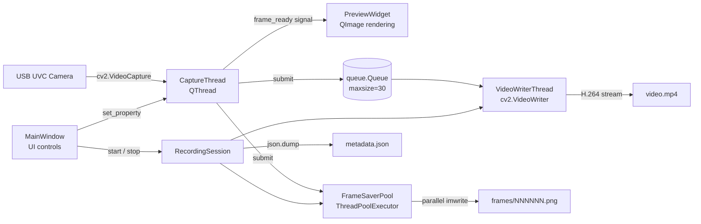
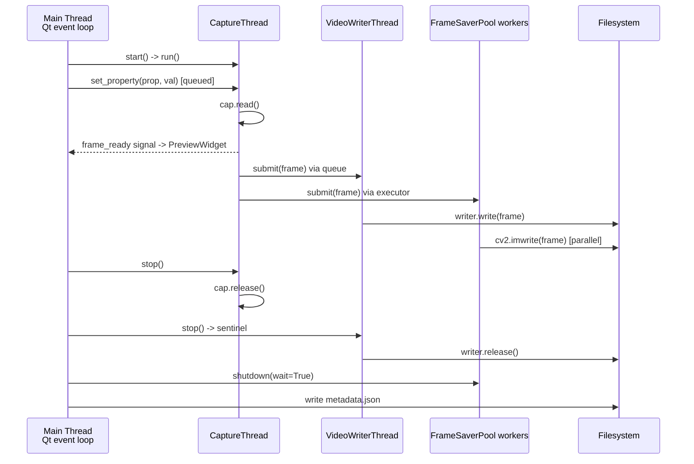
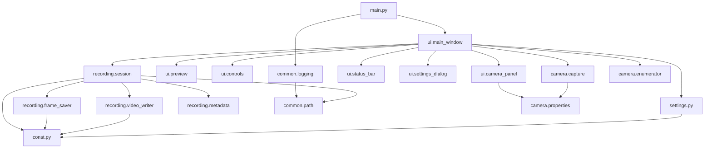

# Архитектура plasma-eye

## Общий поток данных

Источник кадра один — `CaptureThread`. Кадр broadcast'ится на три параллельных потребителя: preview, видео-writer, frame-saver. Каждый потребитель имеет собственную дисциплину backpressure и обрабатывает кадр на своей стороне.

## Threading model

Между потоками используется bounded `queue.Queue` и Qt-сигналы (thread-safe slot dispatch). Внутри `CaptureThread` отложенное применение UVC-параметров защищено `QMutex`. `FrameSaverPool` использует `threading.Lock` для счётчиков.

## Модули

`src/plasma_eye/` разделён на функциональные пакеты. Зависимости направленные: `ui -> recording, camera, settings`; `recording -> common, const`; `camera -> properties`; всё остальное — фундаментные модули без обратных импортов.

## Backpressure

Realtime захват не должен ждать диск. Если диск или CPU не успевают, поведение каждого потребителя:

- `VideoWriterThread` использует `queue.Queue(maxsize=30)`. На `put_nowait` при заполненной очереди увеличивается счётчик `dropped`, эмитится сигнал `frame_dropped`. Каждые 30 дропов пишется warning в лог.
- `FrameSaverPool` отслеживает количество inflight задач. При превышении `FRAME_SAVER_QUEUE_THRESHOLD` (60) новые submit'ы сразу дропаются (`dropped += 1`). Каждые 30 дропов — warning в лог.
- `Preview` обновляется напрямую через Qt-сигнал; если main thread не успевает отрисовать — Qt сам coalesces события (старые сигналы вытесняются новыми), задержки превью не влияют на запись.

Итоговая статистика дропов попадает в `metadata.json` в поле `frames_dropped` и в финальный лог при остановке.

## Обработка ошибок

- Открытие камеры провалилось -> `CaptureThread.error_occurred("Не удалось открыть камеру N")`.
- Камера перестала отдавать кадры (5 подряд неудачных `cap.read()`) -> `error_occurred("Камера отключилась")`, поток завершается.
- Открытие `cv2.VideoWriter` провалилось -> fallback цепочка кодеков `mp4v -> XVID -> MJPG`; при полном провале — `error_occurred` и запись прерывается.
- Создание session-папки `PermissionError`/`OSError` -> `error_occurred("Не удалось создать папку записи: ...")`, `start()` возвращает `None`.
- Свободного места `< 500 MB` -> `warning_emitted` (`QMessageBox` пользователю), запись продолжается.
- Свободного места `< 100 MB` -> `error_occurred`, запись отменяется до создания папки.

## Persistence

Используется нативный `QSettings` через обёртку `AppSettings`. Application/Organization name выставляются в `main.py` один раз через `QApplication.setApplicationName/setOrganizationName`. Сохраняются:

- `recording/dir` — корневая папка записей
- `recording/frame_format`, `recording/frame_quality` — формат и качество фреймов
- `ui/hotkey_start_stop`, `ui/timer_default_seconds` — UI настройки
- `camera/last_index`, `camera/properties_json` — последняя камера и snapshot слайдеров

Физическое расположение:

| ОС      | Путь                                                       |
|---------|------------------------------------------------------------|
| Linux   | `~/.config/plasma-eye/plasma-eye.conf` (INI)               |
| macOS   | `~/Library/Preferences/com.plasma-eye.plasma-eye.plist`    |
| Windows | `HKEY_CURRENT_USER\Software\plasma-eye\plasma-eye` (registry) |

## Логирование

`common.logging.setup_logging()` конфигурирует root logger один раз в `main.py:main()` до создания `QApplication`. Два handler'а:

- `StreamHandler(sys.stderr)` для разработки.
- `RotatingFileHandler` (5 MB, 3 архива) в OS-зависимом каталоге.

Каждый модуль получает свой logger через `logging.getLogger(__name__)`. Уровень по умолчанию — `INFO`. Все WARNING/ERROR попадают и в stderr, и в файл.
