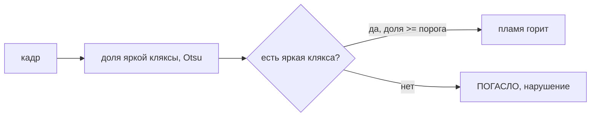

# ml — детекция состояния горелки плазмы

Контроль горения: по кадру камеры определить, **горит пламя** или **погасло**
(нарушение).

## Итог: классический CV, а не YOLO

В приложение вошёл **классический CV-детектор**
(`src/plasma_dog/detection/flame_detector.py`), без нейросети. Признак — **доля
кадра, занятая крупнейшей яркой кляксой** (бинаризация Otsu по размытой яркости).
Переключение состояния защищено **гистерезисом** (две границы порога) и
**сглаживанием** (подтверждение по N подряд идущим кадрам), чтобы одиночные выбросы
не дёргали статус.

- **Калибровка порогов** — метод «середина зазора»: собираются две выборки доли
  кляксы («горит» и «погасло»), берутся перцентили p5(горит) и p95(погасло), между
  ними — зазор, пороги ставятся внутрь него (`detection/calibration.py`).
- **UI**: диалог калибровки (кнопка «Калибровать» -> `CalibrationDialog`) плюс
  ручная правка порогов в настройках. Главное окно показывает индикатор
  «ПЛАМЯ ГОРИТ / ПОГАСЛО» и «Яркость %» (текущая доля кляксы).

### Почему не YOLO (отклонённое исследование)

YOLO26-дообучение (ноутбук `plasma_yolo_finetune.ipynb`) — **задокументированный
тупик**. Пробовали 3 конфигурации обучения, все провалили удержанную электродную
сессию (leave-one-session-out, val = сессия `13-12-18`):

| Конфиг обучения | mAP50 (electrode, val) | Решение по удержанной сессии 13-12-18 |
|---|---|---|
| мягкая аугментация | 0.47 | -1 (не распознано) |
| агрессивная online-аугментация | 0.04 | 0 (ложный flame) |
| оффлайн-аугментация электродов | 0.37 | -1 (не распознано) |

Причина провала: 2 электродные сцены + 1 flame-сцена не дают обобщения на невиданную
сессию. Класс `flame` размечен как full-frame бокс (по сути «яркость кадра») — YOLO
не учит его стабильно, а аугментация лишь дестабилизирует обучение.

**Почему классика работает.** Доля яркой кляксы чисто разделяет состояния на
фиксированной камере. На реальных данных (по 60–80 кадров на сессию): flame —
37–73 % кадра, electrode — ~18–20 %, зазор ~17–20 п.п. Порог, поставленный в зазор,
даёт **0 ошибок на ~180 кадрах**, включая ту сессию `13-12-18`, на которой YOLO
валился. Признак инвариантен к отражению/яркости камеры — это доля площади, а не
абсолютная яркость.

## Реальность данных (важно)

`data/raw/Снимки и видео/` — **3 записи** по ~988 кадров (1 fps, 1920×1080):

| Сессия | Метка | Состояние |
|---|---|---|
| `…15-05-43 хорошо` | 0 | пламя горит (клякса) |
| `…10-26-28 плохо` | 1 | пламя погасло (электроды) |
| `…13-12-18 плохо` | 1 | пламя погасло (электроды) |

Датасет **непригоден для честной оценки обобщения** ML по трём причинам:

1. состояние **постоянно внутри каждой сессии** (переходов горит->погасло нет),
   соседние кадры — почти-дубликаты (corr ~ 0.999) -> фактически **3 сцены**;
2. класс `flame` представлен **единственной** сессией -> независимой валидации нет;
3. классы **разделяются глобальной яркостью/настройками камеры** — полнокадровый
   классификатор выучит камеру, а не плазму.

Классический детектор обходит причину №3 не яркостью, а **долей площади** кляксы
(инвариант к настройкам камеры). Причины №1–2 остаются ограничением для любого ML и
лечатся только **сбором новых данных**: записи при разных настройках камеры
(экспозиция, WB, gain), сессии с реальным переходом горит->погасло внутри одной
записи, больше одной `flame`-сцены.

## Файлы

- **`baseline.py`** — честная диагностика «запоротости» данных: сравнивает Random /
  Temporal / LOSO протоколы и пробу конфаундинга (логрегрессия на яркости V+S).
  Запуск: `python ml/baseline.py` (нужны `opencv-python`, `numpy`, `scikit-learn`).
- **`plasma_yolo_finetune.ipynb`** — **отклонённое** исследование YOLO26 (Colab, GPU):
  полу-авто разметка -> сборка датасета (split по сессиям) -> обучение 3 конфигов ->
  валидация LOSO -> экспорт ONNX. Оставлен как документация тупика (см. выше).

## Правило приложения

Гистерезис: между нижним и верхним порогом состояние удерживается прежним;
переключение — только при уверенном пересечении границы в течение N кадров.
